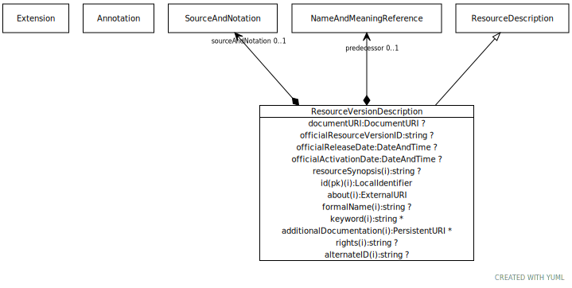

# Type: ResourceVersionDescription

Information about the source, format, release date, version identifier, etc. of a specific version of an
abstract resource.

URI: [tccm:ResourceVersionDescription](https://hotecosystem.org/tccm/ResourceVersionDescription)

## Parents

 *  is_a: [ResourceDescription](ResourceDescription.md) - ResourceDescription represents the shared characteristics common to both abstract and resource version

## Referenced by class

## Attributes

### Own

 * [ResourceVersionDescription➞documentURI](ResourceVersionDescription_documentURI.md)  OPT
    * Description: A URI that identifies the specific version, language, and notation of the about resource. This URI needs to be constructed in such a way that, if necessary, it will be possible to differentiate resource versions that were loaded from different document syntaxes. As an example, if an image of a wine ontology was loaded from a resource that was in Manchester Syntax, it should be given a different URI than the image loaded from the RDF/XML syntax. The reasoning behind this is, even in cases where different syntaxes are 100% compatible the transformation into the TCCM model may not be identical.
    * range: [DocumentURI](types/DocumentURI.md)
 * [ResourceVersionDescription➞officialActivationDate](ResourceVersionDescription_officialActivationDate.md)  OPT
    * Description: The date that this version of the resource is stated by its publishers to go into effect.
    * range: [DateAndTime](types/DateAndTime.md)
 * [ResourceVersionDescription➞officialReleaseDate](ResourceVersionDescription_officialReleaseDate.md)  OPT
    * Description: The date that this version of the resource officially became available.
    * range: [DateAndTime](types/DateAndTime.md)
 * [ResourceVersionDescription➞officialResourceVersionID](ResourceVersionDescription_officialResourceVersionID.md)  OPT
    * Description: An official label or identifier that was assigned to this version by its publisher
    * range: [String](types/String.md)
 * [ResourceVersionDescription➞predecessor](ResourceVersionDescription_predecessor.md)  OPT
    * Description: A reference to the name and URI version of the resource from which this current version is derived - the
version of the resource that immediately preceded it.
    * range: [NameAndMeaningReference](NameAndMeaningReference.md)
 * [ResourceVersionDescription➞sourceAndNotation](ResourceVersionDescription_sourceAndNotation.md)  OPT
    * Description: A description of where the (or a) source of the version may be found, what format and language it is
available in, etc.
    * range: [SourceAndNotation](SourceAndNotation.md)

### Inherited from ResourceDescription:

 * [ResourceDescription➞about](ResourceDescription_about.md)  REQ
    * Description: The (or a) definitive URI that represents the resource being described. Note that this is NOT the URI of the
resource description in the TCCM or other format, but of the resource itself. As an example, the about URI
for the Wine ontology would be “http://www.w3.org/TR/2003/PR-owl-guide-2003 1209/wine#.” The NCI Thesaurus
has, among others, the about URI of http://ncicb.nci.nih.gov/xml/owl/EVS/Thesaurus.owl#. HL7 uses ISO Object
Identifiers (OIDs) to label resources so, from the HL7 perspective, the about URI of the NCI Thesaurus would
be “urn:oid:2.16.840. 1.113883.3.26.1.1”
    * range: [ExternalURI](types/ExternalURI.md)
 * [ResourceDescription➞additionalDocumentation](ResourceDescription_additionalDocumentation.md)  0..*
    * Description: A reference to a document that provide additional information about the resource.
    * range: [PersistentURI](types/PersistentURI.md)
 * [ResourceDescription➞alternateID](ResourceDescription_alternateID.md)  OPT
    * Description: An alternative identifier that uniquely names this resource in other environments as contexts.
As an example, if a resource had both an ISO Object Identifier and a DNS name, the DNS name might be assigned
as the entryID of the resource by one service while the ISO OID would be recorded as an alternateURI using
the “urn:oid” prefix. Note that alternateIds can be added or removed during resource updates.
    * range: [String](types/String.md)
 * [ResourceDescription➞formalName](ResourceDescription_formalName.md)  OPT
    * Description: The formal or officially assigned name of this resource, if any.
    * range: [String](types/String.md)
 * [ResourceDescription➞keyword](ResourceDescription_keyword.md)  0..*
    * Description: Additional identifiers that are used to index and locate the resource.
    * range: [String](types/String.md)
 * [ResourceDescription➞rights](ResourceDescription_rights.md)  OPT
    * Description: Copyright and IP information. Note that rights applies to the source resource, not the CTS2 rendering.
    * range: [String](types/String.md)
 * [resourceID](resourceID.md)  REQ
    * Description: A local identifier that uniquely names the resource within the context of the describedResourceType and
implementing service. As an example, this might be “SCT” for the SNOMED-CT code system, “SCT-2010AA” for a
SNOMED-CT code system version.
    * range: [LocalIdentifier](types/LocalIdentifier.md)
 * [resourceSynopsis](resourceSynopsis.md)  OPT
    * Description: A textual summary of the resource - what it is, what it is for, etc.
    * range: [String](types/String.md)
