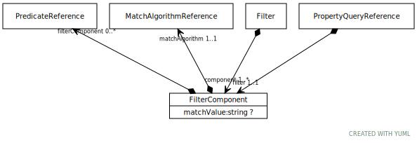

# Type: FilterComponent

A restriction on an attribute, property, or special field.

URI: [tccm:FilterComponent](https://hotecosystem.org/tccm/FilterComponent)

## Referenced by class

 *  **[Filter](Filter.md)** *[Filter➞component](Filter_component.md)*  1..*  **[FilterComponent](FilterComponent.md)**
 *  **[PropertyQueryReference](PropertyQueryReference.md)** *[PropertyQueryReference➞filter](PropertyQueryReference_filter.md)*  REQ  **[FilterComponent](FilterComponent.md)**
 *  **None** *[component](component.md)*  1..*  **[FilterComponent](FilterComponent.md)**
 *  **None** *[filter](filter.md)*  REQ  **[FilterComponent](FilterComponent.md)**

## Attributes

### Own

 * [FilterComponent➞filterComponent](FilterComponent_filterComponent.md)  0..*
    * Description: The name or URI of the property or model element to be filtered. Properties are referenced by
their predicate and model elements all have URIs that are established by this specification.
    * range: [PredicateReference](PredicateReference.md)
 * [FilterComponent➞matchAlgorithm](FilterComponent_matchAlgorithm.md)  REQ
    * Description: The algorithm to be used for testing the referenced component. Examples might include “starts with,”
“regular expression match,” “exists,” “inRange,” etc.
    * range: [MatchAlgorithmReference](MatchAlgorithmReference.md)
 * [FilterComponent➞matchValue](FilterComponent_matchValue.md)  OPT
    * Description: The value to be used in comparison. The structure and format of matchValue depends on the specific
matchAlgorithm. As an example, a “startsWith” algorithm would be plain text, a “regularExpression” algorithm
would have a regular expression while an “exists” algorithm would have nothing in the matchValue attribute.
    * range: [String](types/String.md)
